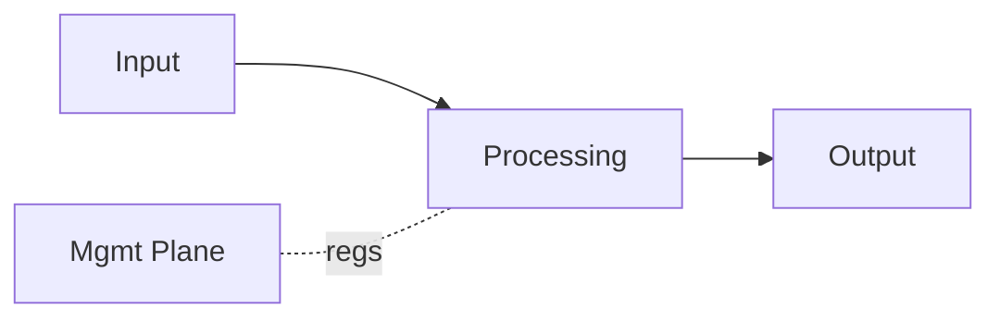
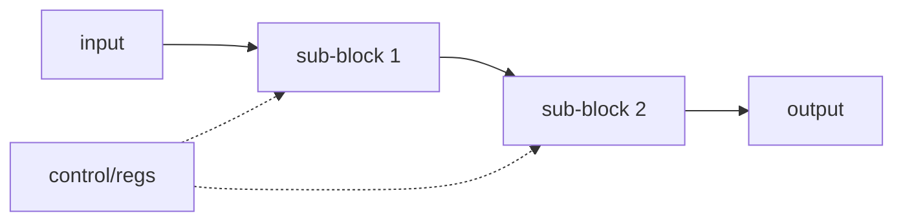
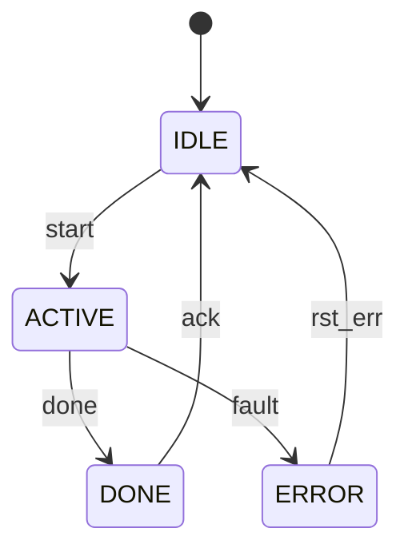

# SFU FPGA Documentation

The `arch/` folder of `bpms-sfu-fpga-design` is the single source of truth for the SFU FPGA specifications. It sits alongside `rtl/`, `model/`, `constraints/`, `prj/`, `scripts/`, and `docs/` in the design repo, and is consumed as read-only reference by the companion `bpms-sfu-fpga-verif` repo.

## Document types

| Type | Purpose | Count | Lifetime |
|---|---|---|---|
| **FAD** — FPGA Architecture Document | Device-level architecture of the SFU FPGA | 1 | Baselined at milestone, re-baselined on major change |
| **MDS** — Module Design Spec | Per-module blueprint for RTL implementation | N (one per module) | Baselined before RTL sign-off |
| **ICD** — Interface Control Document | Shared protocols / interfaces | ~5 | Frozen once modules commit |
| **ADR** — Architecture Decision Record | "Why" behind non-trivial choices | As needed | Immutable once accepted |
| **RTM** — Requirements Traceability Matrix | Req → module → test linkage | 1 (live) | Updated continuously |

No separate HRD (requirements are inherited from SFU Arch Doc §18). No separate VPlan (unit TBs live in MDS §11, UVM owned by DV). No separate assumptions/open-questions logs — each doc carries its own §13 table; if cross-doc grouping becomes useful later, promote to `RISKS.md`.

## Layout

```
arch/
├── README.md                 # this file
├── fad/
│   ├── _template.md          # copy for each new project (reusable)
│   └── FAD.md                # project FAD
├── modules/
│   └── _template.md          # copy this for each new module
├── icd/
│   └── _template.md          # copy this for each new ICD
├── adr/
│   ├── _template.md
│   └── NNNN-<kebab-title>.md
└── rtm.md
```

Module files are named after the RTL module (`snake_case`), e.g. `modules/obg_rx.md`. ICD files are named after the interface (`snake_case`), e.g. `icd/streaming_bus.md`. ADRs use `NNNN-short-kebab-title.md`.

## Authoring order (recommended)

1. **FAD §1–§6** — scope, functional boundary, key decisions, top-level diagram, dataflow, clocking, module inventory. The module inventory drives every MDS filename that follows.
2. **Core ICDs** — streaming_bus, register_bus, obg_frame. These are referenced by every MDS; define them first.
3. **FAD §7–§11** — interface conventions, fixed-point policy, budgets, debug, mgmt. Non-trivial choices here spawn ADRs.
4. **MDSs** — start with simplest modules (RF port select, register bus adapter, CDC FIFO) to shake down the template; hardest last (filter bank wrappers, Band Doppler NCO, Band Gain loop).
5. **RTM** — seed from parent requirements doc on day one; update continuously, never retrofitted.

## Conventions

### Frontmatter
Every document starts with a YAML frontmatter block. Machine-readable metadata (status, version, source doc refs) supports Claude and Claude Code doing consistency checks across the folder.

### Lifecycle status values
- **draft** — being written
- **in_review** — feedback gathering
- **baselined** — reviewed and approved; change requires re-review
- **frozen** — no further changes allowed without major version bump (typically ICDs post-RTL start)
- **superseded** — replaced by a newer document; link to successor

MDSs additionally carry one of:
- **rtl_ready** — every RTL-ready criterion met; Claude Code can generate RTL from this + referenced ICDs
- **not_rtl_ready** — at least one criterion unmet; frontmatter `rtl_ready_blocking:` lists each missing item

### Placeholder markers
Every in-progress document will contain unresolved items. Mark them explicitly and consistently:

- `[TBD: <reason>, <owner>]` — value not yet known; who owns the resolution
- `[STUB: <blocking item>]` — section deliberately empty; name the blocker
- `[ASSUMPTION: <text>, <expiry trigger>]` — chosen without source confirmation; name the event that will confirm or overturn it
- `[INFERRED from <source §>]` — derived from a source doc but not literally stated there

These markers are greppable. The last two preserve the distinction the project demands: *specified / inferred / proposed* must never collapse.

### Citation discipline
Every factual claim traceable to a parent document must carry an inline citation: `(ARCH-001 §5.2)` or `(SFU-001 §6.4)`. Claims without a citation are treated as derived or proposed and must carry the matching marker (`[INFERRED]` or `[ASSUMPTION]`).

### Baselining and review gates
A document reaches **baselined** only after the relevant gates below are green. These map to UG949's UltraFast Design Methodology checks and NASA GSFC's FPGA design review flow — adapted and compressed.

| Gate | Scope | Artefacts checked |
|---|---|---|
| **G1 Orient** | FAD §1–§6 | Scope, boundary, block diagram, clocking, module inventory consistent |
| **G2 Contracts** | FAD §7, §8; core ICDs | Interface conventions, fixed-point policy, ICDs frozen |
| **G3 Budgets** | FAD §9 | Latency, resource, floorplan, power — all cells populated or explicitly TBD with owner |
| **G4 MDS sign-off** | Per MDS | `rtl_ready` criteria (see MDS §11 self-check); bit-true refmodel correlated; unit-TB coverage met |
| **G5 Handoff to DV** | Baselined MDS + RTL + TB | DV can consume without architect follow-up |

No gate may be waived silently. Waivers are recorded as ADRs.

## Claude-assisted workflow notes

- All docs are Markdown-in-Git — diffable, reviewable via PR, friendly to Claude and Claude Code.
- Keep FAD §2 diagram and §6 module inventory consistent — Claude can cross-check on each commit.
- MDS skeleton is stable: once one MDS is reviewed clean, use it as the pattern Claude fills for the rest.
- RTM maintenance is a good Claude task: given FAD + MDSs, regenerate the RTM table and diff against the current file.
- Handoff to Claude Code: RTL generation prompt = MDS + referenced ICD(s) + FAD §7 (interface conventions) + FAD §8 (fixed-point policy). That's the minimum sufficient context.
- YAML frontmatter `status` and `rtl_ready_blocking` are intended to be machine-checkable — e.g. a pre-commit hook that blocks merges if any MDS referenced by an `rtl_ready` RTL module is still `not_rtl_ready`.

## Parent documents (outside this folder)

- **BPMS 1.0 System Architecture Document** — BPMS-1.0-ARCH-001 (system context, system-level ICDs, SYS-* requirements)
- **BPMS 1.0 SFU Architecture Document** — BPMS-1.0-SFU-001 (SFU functional architecture, SFU-* requirements)

Neither is duplicated here. Both are cited by section number from FAD and MDSs.

---

<!--
  ████████████████████████████████████████████████████████████
  TEMPLATES — copy each section into its own file
  ████████████████████████████████████████████████████████████
-->

# FPGA Design Templates

Consolidated template set for Claude-assisted FPGA design workflow.
Five artefact types: FAD → MDS → ICD → ADR → RTM.

Each section is a standalone template. Copy into its own file when creating a new project.

---

<!--
  ████████████████████████████████████████████████████████████
  FAD — FPGA Architecture Document
  ████████████████████████████████████████████████████████████
-->

# FAD — FPGA Architecture Document

```yaml
---
doc_id: <project>-FAD-001
doc_type: fad
project: <project>
status: draft           # draft | in_review | baselined | frozen | superseded
version: 0.1
date: YYYY-MM-DD
author: <name>
source_docs:
  - <system arch doc> v<x>
  - <device arch doc>  v<x>
---
```

---

## 1. Scope and Context

### 1.1 Purpose
This document is the **FPGA Architecture Document (FAD)** for `<device/subsystem>`. It defines the device-level architecture of the RTL design: module decomposition, clocking, CDC, memory, interface conventions, fixed-point policy, and budgets. It is the parent of all per-module Module Design Specs (MDSs).

### 1.2 Functional boundary
*What this FPGA owns, what it explicitly does not own, and how boundary-crossing proposals are handled. The table is load-bearing — it is the authoritative ownership map.*

#### 1.2.1 In scope
| Function | Granularity | Apply mechanism | Source |
|---|---|---|---|
| `<function>` | `<per-card / per-sub-band / per-lane>` | `<UTC-scheduled / local autonomous / structural / continuous>` | `<doc §>` |
| … | | | |

#### 1.2.2 Out of scope
| Function | Owner | Source |
|---|---|---|
| `<function>` | `<peer device / system>` | `<doc §>` |
| … | | |

#### 1.2.3 Boundary-crossing procedure
Any proposal requiring this FPGA to take on a function listed in §1.2.2, or a peer device to take on a function listed in §1.2.1, is a boundary change. Handling:
1. Open an ADR.
2. Cite the system-level source that would justify the change.
3. If no such source exists, the proposal is rejected by default.

### 1.3 Out of scope (document-level)
- Functional requirements — see `<parent requirements doc>`.
- Per-module micro-architecture (FSMs, pipeline stages, register-level detail) — see MDSs.
- Board, chassis, and cabling — see `<system architecture doc>`.
- UVM verification plan — owned by DV team; this doc defines the handoff only.

### 1.4 Key architectural decisions
*One-sentence summary of each load-bearing decision with ADR pointer. This is the "solution strategy" view — read this to understand the shape of the design in five minutes.*

| # | Decision | ADR |
|---|---|---|
| 1 | `<e.g. AXI-Stream as internal streaming bus>` | [ADR-0001](../adr/0001-….md) |
| 2 | `<e.g. CDR-per-card independent clocking>` | [ADR-0002](../adr/0002-….md) |
| 3 | `<e.g. MDFT filter bank topology, 2 sub-bands>` | [ADR-0003](../adr/0003-….md) |
| … | | |

### 1.5 Parent documents
| Ref | Document | ID | Version |
|---|---|---|---|
| [P1] | `<system architecture doc>` | | |
| [P2] | `<device architecture doc>` | | |
| [P3] | `<filter bank / DSP spec>` | | |

### 1.6 Design baseline
`<Clean-sheet / port from <source> / wrapper around <IP>>`. Any RTL reuse must be justified via ADR.

### 1.7 Target device
| Parameter | Value |
|---|---|
| Device | |
| Speed grade | |
| Package | |
| Toolchain | |

---

## 2. Top-Level Block Diagram

*Every block shown here MUST appear in §6 Module Inventory with an MDS link.*



---

## 3. Dataflow

### 3.1 Downlink / primary path
`<Narrative: stage by stage, sample rates, bus widths, frame boundaries. One paragraph per stage. Describe implementation dataflow, not functional behaviour — that lives in the parent doc.>`

### 3.2 Uplink / return path
`<Same treatment.>`

### 3.3 Debug and auxiliary paths
- **Playback injection point:** `<where, how muxed with live data>`
- **Capture tap points:** `<list: tap name, signal width, clock domain>`
- **Loopback wiring:** `<digital and/or RF loopback routes, if any>`
- **Other auxiliary paths:** `<beacon injection, test tone injection, etc.>`

---

## 4. Clocking and Reset Architecture

### 4.1 Clock inventory
| Clock name | Frequency | Source | Consumers | Notes |
|---|---|---|---|---|
| `clk_<n>` | | | | |
| … | | | | |

### 4.2 Clock topology
*`<Diagram or description: PLL/MMCM sources, buffers, gated vs. free-running.>`*

### 4.3 Primary vs Secondary clock mode (if applicable)
| Aspect | Primary | Secondary |
|---|---|---|
| Source | | |
| Propagation | | |
| Switchover | | |

### 4.4 Reset topology
| Reset name | Domain | Assertion | Release | Scope |
|---|---|---|---|---|
| `rst_<n>_n` | | async | sync deassert | |
| … | | | | |

### 4.5 CDC inventory
Every clock-domain crossing in the design must appear here. No CDC may exist that is not in this table.

| ID | From domain | To domain | Type | Data width | Mechanism | MDS |
|---|---|---|---|---|---|---|
| CDC-01 | | | | | | |
| … | | | | | | |

---

## 5. Memory Architecture

### 5.1 On-chip memory allocation
| Function | Type | Size | Module | Notes |
|---|---|---|---|---|
| | BRAM | | | |
| | URAM | | | |
| … | | | | |

### 5.2 External memory
`<Used / not used. If used: controller, arbiter, bandwidth budget.>`

---

## 6. Module Inventory

Canonical list of every RTL module. Every block in §2 MUST have a row.

| # | Module | MDS | Reuse | Clock domain(s) | Owner | Status |
|---|---|---|---|---|---|---|
| 1 | `<module_name>` | [modules/<module_name>.md](../modules/<module_name>.md) | new / wrap / third-party | | | draft |
| … | | | | | | |

**Reuse legend:** `new` = clean RTL; `wrap` = IP wrapped with project ports; `third-party` = vendor IP used as-is.

---

## 7. Internal Interface Conventions

All inter-module interfaces use one of the following. Deviations require an ADR.

### 7.1 Streaming data
- **Convention:** `<AXI-Stream / custom valid-ready / other>` — see [ICD streaming_bus](../icd/streaming_bus.md).
- **Width policy:** `<default data width per sample domain>`
- **Backpressure rule:** `<ready-low tolerance, upstream FIFO requirements>`
- **Packet framing:** `TUSER[...]` carries `<fields>`; `TLAST` on `<boundary>`.

### 7.2 Register / control access
- **Convention:** `<AXI-Lite / APB / custom>` — see [ICD register_bus](../icd/register_bus.md).
- **Address map:** see [ICD mgmt_regmap](../icd/mgmt_regmap.md).
- **Access width:** `<32-bit / other>`.

### 7.3 Handshake and backpressure
- Every streaming interface must tolerate downstream stall without dropping samples or corrupting frames.
- Any module that cannot stall must document its no-stall contract in its MDS.

---

## 8. Fixed-Point and Numerical Policy

### 8.1 Representation
- **IQ samples:** signed two's complement, Q`<a.b>` per stage.
- **Native wire format at source interface:** `<width>` bits per component.
- **Native wire format at sink interface:** `<width>` bits per component.

### 8.2 Per-stage Q-format table
| Stage | I/Q width | Q-format | Headroom (bits) | Notes |
|---|---|---|---|---|
| Source input | | Q`<a.b>` | | |
| Post `<stage>` | | | | |
| Sink output | | | | |
| … | | | | |

### 8.3 Growth, rounding, saturation
- **Growth rule:** `<full precision internal / truncate at module boundaries / other>`
- **Rounding mode:** `<round-to-nearest-even / convergent / truncate>` — per stage or global.
- **Saturation:** `<symmetric / asymmetric>`, logged on event, alarm raised.
- **Overflow tracking:** per-stage clip counter, readable via mgmt.

### 8.4 Reference model
- **Language:** `<MATLAB / Python>` — see ADR-`<n>`.
- **Location:** `models/refmodel/`
- **Bit-true boundary:** every module with non-trivial DSP must have a bit-true reference; unit TB correlates RTL to refmodel within `<tolerance>`.

---

## 9. Budgets

### 9.1 Latency budget
| Stage | DL cycles | DL ns | UL cycles | UL ns | MDS |
|---|---|---|---|---|---|
| `<stage>` | | | | | |
| … | | | | | |
| **Total** | | | | | |
| **Budget** | | | | | |
| **Margin** | | | | | |

### 9.2 Resource budget
| Module | LUT | FF | BRAM | URAM | DSP | Notes |
|---|---|---|---|---|---|---|
| `<module>` | | | | | | |
| … | | | | | | |
| **Total estimate** | | | | | | |
| **Device capacity** | | | | | | |
| **Utilization %** | | | | | | target ≤ 70% pre-P&R, hard fail > 85% post-synth |

### 9.3 Floorplan intent
*Placement intent that shapes RTL structure (e.g. SLR-crossing pipelining, RFdc-adjacent placement). Not a physical floorplan — a constraint on how modules are written.*

| Concern | Intent |
|---|---|
| SLR topology | `<device SLR count; which SLR owns which sub-system>` |
| RF-facing blocks | `<placement constraint near RFdc tiles>` |
| Transceiver-facing blocks | `<placement near GTY/GTH quads>` |
| SLR-crossing buses | `<pipelining rule, e.g. ≥ 2 registers>` |
| Management domain isolation | `<isolated from DSP SLR / other>` |

### 9.4 Power budget
`<Preliminary XPE estimate per rail. Note thermal constraints. Revisit post-synthesis.>`

---

## 10. Debug and Observability Architecture

### 10.1 Minimum telemetry set per module
Every module in §6 Module Inventory MUST expose, at a minimum, the following — via the register bus in §7.2:

| Field | Type | Purpose |
|---|---|---|
| `block_id` | RO | Module identification |
| `fw_version` | RO | Per-module firmware segment |
| `state` | RO | `{idle, running, error, stalled}` |
| `frames_in` | RO counter | Cumulative input frames |
| `frames_out` | RO counter | Cumulative output frames |
| `saturation_count` | RO counter | Any saturating point in this module |
| `error_count` | RO counter | All errors aggregated |
| `last_error_code` | RO | Most recent error |

Additional module-specific telemetry is listed in each MDS.

### 10.2 Capture infrastructure
- Tap points: `<list with MDS reference and clock domain>`
- Buffer type/depth: `<URAM / BRAM, depth>`
- Trigger sources: on-demand / time-triggered (UTC) / event-triggered
- Download: `<mechanism, intrusive / non-intrusive>`

### 10.3 Playback infrastructure
- Injection point: `<where in pipeline>`
- Source: `<buffer type, depth>`
- Trigger: `<immediate / time-aligned / 1PPS-aligned>`
- Mutex with live traffic: `<mechanism>`

### 10.4 Event log
- Storage: `<type, depth, persistence>`
- Event categories: CDC (FIFO correction) / Link (CDR lock, lane up) / Numeric (saturation, clipping) / Parameter (apply ok/fail) / Timing (1PPS miss, UTC drift) / Alarm
- Download: `<mechanism>`

### 10.5 Spectrum monitor / spur detection (if applicable)
- Path: `<UL / DL, location in pipeline>`
- Resolution: `<bin width>`
- Update rate: `<TBD / spec>`

### 10.6 Loopback modes
- `<Digital loopback: feasibility, insertion point>`
- `<RF loopback: in scope / out of scope>`

---

## 11. Management Plane

### 11.1 Topology
*`<Block diagram: MAC → mgmt_if → register bus → per-module banks.>`*

### 11.2 Register bus
- Protocol: `<AXI-Lite / APB>`, `<width>`-bit, see ICD.
- CDC from mgmt clock into DSP domains: per CDC inventory §4.5.

### 11.3 Scheduled apply mechanism (if applicable)
- Pre-load path: `<mgmt writes value + timestamp into shadow register>`
- Trigger: `<UTC tick / other>`
- Commit: shadow → live atomically at trigger; confirmation logged.

### 11.4 Autonomous update mechanism (if applicable)
- Source data: `<TLE / other>` written by `<Manager SW / NMS>`.
- Compute: `<device-local, 1 Hz / other>`.
- Apply: `<1PPS tick / other>`, no external schedule.

### 11.5 Non-volatile configuration
`<What is persisted, where (QSPI flash / other), restore sequence on power-on.>`

---

## 12. Verification Strategy (thin)

### 12.1 Two-tier model
| Tier | Scope | Owner | Sign-off |
|---|---|---|---|
| Unit testbench | One module, bit-true where applicable | RTL author | Coverage + refmodel correlation per MDS §11 |
| UVM integration | Sub-system and top-level | DV team | Functional + code coverage per DV VPlan |

### 12.2 Unit TB style
- Language: `<SystemVerilog / cocotb>` — see ADR.
- Stimulus: directed + constrained random; file-driven from refmodel where bit-true required.
- Coverage: functional + FSM state + code (line, toggle, branch).

### 12.3 Reference models
- Location: `models/refmodel/`, language per ADR-`<n>`.
- Module-level wrappers produce stimulus + expected outputs for unit TBs.

### 12.4 Handoff to DV (per module at unit-TB sign-off)
1. RTL source + constraints
2. MDS (baselined)
3. Unit TB + coverage report
4. Refmodel (bit-true modules)
5. Known issues / waivers

### 12.5 What DV re-verifies at UVM level
- All inter-module interfaces
- End-to-end latency vs. budget
- System-level functional requirements
- Stress, error injection, recovery

---

## 13. Open Issues and Risks

| ID | Issue | Impact if wrong | Expiry trigger | Owner | Status |
|---|---|---|---|---|---|
| FAD-OI-01 | | | | | open |
| … | | | | | |

*Each row names the event that will resolve the issue. A row with no expiry trigger is not actionable and should be refined before acceptance.*

---

## 14. Glossary and References

### 14.1 Project-specific terms
| Term | Meaning |
|---|---|
| FAD | FPGA Architecture Document (this doc) |
| MDS | Module Design Spec |
| ICD | Interface Control Document |
| ADR | Architecture Decision Record |
| RTM | Requirements Traceability Matrix |

### 14.2 References
| Ref | Document |
|---|---|
| [1] | `<system architecture doc>` |
| [2] | `<device architecture doc>` |
| [3] | `<target device datasheet>` |
| [4] | `<IP product guides>` |

---

## 15. Change Log

| Version | Date | Author | Change |
|---|---|---|---|
| 0.1 | YYYY-MM-DD | | Initial skeleton |

---

<!--
  ████████████████████████████████████████████████████████████
  MDS — Module Design Spec
  ████████████████████████████████████████████████████████████
-->

# MDS — Module Design Spec: `<module_name>`

```yaml
---
doc_id: <project>-MDS-<module_name>
doc_type: mds
project: <project>
module_name: <module_name>
status: draft                   # draft | in_review | baselined | frozen | rtl_ready | not_rtl_ready | superseded
rtl_ready_blocking:             # empty list iff status == rtl_ready
  - [STUB: <blocking item>, <owner>]
version: 0.1
date: YYYY-MM-DD
author: <name>
reviewer: [TBD]
source_docs:
  - <system doc §>
  - <device doc §>
related:
  icd_interfaces: [IF-…, IF-…]
  adrs: [ADR-000x]
  refmodel: <models/refmodel/<module_name>/>     # or [TBD: owner]
  bit_exactness: bit_exact                       # bit_exact | ulp_bounded | not_applicable
  ulp_bound: 0                                   # 0 for bit_exact, else integer
---
```

> Blueprint from which RTL is implemented. A junior RTL engineer or Claude Code should be able to implement this module from this document alone. If a section is genuinely N/A, write "N/A" with a one-line reason — do not delete the section.

---

## 1. Identity

| Field | Value |
|---|---|
| Module name | `<module_name>` |
| Top file | `rtl/<module_name>.sv` |
| Hierarchy path | `<top>.<subsystem>.<module_name>` |
| Parent FAD section | [§`<x>`](../fad/FAD.md#`<anchor>`) |
| Upstream requirements | `<SFU-SIG-0x, SYS-LAT-0x, …>` |
| Related ADRs | `ADR-000x` |
| Reuse | new / wrap / third-party |
| Owner | |

---

## 2. Purpose and Scope

### 2.1 What this module does
`<One paragraph. Crisp. What function does this module perform?>`

### 2.2 What this module does not do
`<One paragraph. Explicit exclusions. What might someone assume it does that it doesn't?>`

### 2.3 Position in the signal chain
Upstream module: `<x>`. Downstream module: `<y>`. See FAD §2 diagram.

---

## 3. Functional Description

### 3.1 Behaviour
`<Prose + equations. Enough detail that a reader who hasn't read the parent docs understands the function.>`

### 3.2 Operating modes
| Mode | Description | Entry condition |
|---|---|---|
| Operational | Normal behaviour | Default after reset |
| Static (debug) | Frozen values, dynamic updates suppressed | Set via mgmt register |
| `<other>` | | |

*If single mode only: "Single mode — always operational."*

### 3.3 Reference model
| Field | Value |
|---|---|
| Required | yes / no |
| Language | MATLAB / Python |
| Path | `models/refmodel/<module_name>/` |
| Bit-exactness policy | `bit_exact` / `ulp_bounded (bound=N)` / `not_applicable (vendor IP opaque)` |
| Tolerance boundary | `<which signal / which stage>` |

---

## 4. Block Diagram



---

## 5. Interfaces

### 5.1 Ports
| Port | Dir | Width | Clock | Reset | Protocol | Description |
|---|---|---|---|---|---|---|
| `clk` | in | 1 | — | — | — | Module clock |
| `rst_n` | in | 1 | `clk` | — | async assert / sync release | Active-low reset |
| `s_axis_tdata` | in | `<w>` | `clk` | `rst_n` | AXI-Stream | Input stream |
| `s_axis_tvalid` | in | 1 | | | AXI-Stream | |
| `s_axis_tready` | out | 1 | | | AXI-Stream | |
| `s_axis_tlast` | in | 1 | | | AXI-Stream | Frame boundary |
| `s_axis_tuser` | in | `<w>` | | | AXI-Stream | See streaming_bus ICD |
| `m_axis_*` | out/in | | | | AXI-Stream | Output mirror |
| `cfg_*` | in | `<w>` | `clk_mgmt` | | CDC | Config from register bank |
| `sts_*` | out | `<w>` | `clk_mgmt` | | CDC | Status to register bank |
| `evt_*` | out | 1 | `clk` | `rst_n` | pulse | Event to event log |

### 5.2 Parameters (generics)
| Parameter | Type | Default | Legal range | Description |
|---|---|---|---|---|
| `DATA_WIDTH` | int | 16 | {12,14,16,18} | IQ component width |
| `<PARAM>` | | | | |

### 5.3 Register map (module-visible)
*If no registers: "No module-visible registers — configured via generics only."*

| Offset | Name | Bits | Access | Reset | Apply | Description |
|---|---|---|---|---|---|---|
| 0x00 | `CTRL` | [0] enable | RW | 0 | immediate | Module enable |
| 0x04 | `CFG_A` | [15:0] | RW | 0 | UTC-scheduled | |
| 0x08 | `STATUS` | [0] busy | RO | — | — | |

Full register map: [icd/mgmt_regmap.md](../icd/mgmt_regmap.md).

---

## 6. Clocking, Reset, CDC

### 6.1 Clock domains
| Domain | Signals | Notes |
|---|---|---|
| `<clk_name>` | datapath | Primary processing |
| `clk_mgmt` | `cfg_*`, `sts_*` | Via register bus |

### 6.2 Reset
- Reset: `rst_n`, active-low, async assert, sync release to `<clock>`.
- Reset-while-busy: `<drop samples / complete-then-reset / assert error>`.
- FSMs return to: `<state>`. FIFOs flushed: yes / no.

### 6.3 Internal CDC
*Most leaf modules should be single-domain. If none: "No internal CDC — single clock domain."*

| ID | From | To | Type | Mechanism |
|---|---|---|---|---|
| | | | | |

All CDC listed here must also appear in FAD §4.5.

---

## 7. Fixed-Point Format

### 7.1 Per-signal Q-format
| Signal | Width | Q-format | Range | Notes |
|---|---|---|---|---|
| `s_axis_tdata.I` | 16 | Q1.15 | [-1, 1) | Per FAD §8.2 |
| `s_axis_tdata.Q` | 16 | Q1.15 | | |
| Internal accumulator | | | | Full precision |
| `m_axis_tdata.I/Q` | | | | Rounded + saturated |

### 7.2 Growth, rounding, saturation
- Growth: per FAD §8.3.
- Rounding: `<round-to-nearest-even / other>`.
- Saturation: symmetric; clip counter in `sts_clip_count[31:0]`, event on increment.

### 7.3 Numerical correctness
- Bit-exactness policy (from frontmatter): `<bit_exact / ulp_bounded / not_applicable>`.
- Measurement point: `<which ICD boundary>`.
- Tolerance: `<0 LSB for bit_exact / N LSB for ulp_bounded / dB metric for vendor-IP boundary>`.

---

## 8. Micro-architecture

### 8.1 Pipeline
| Stage | Function | Latency (cycles) | Notes |
|---|---|---|---|
| 0 | Input register | 1 | |
| 1 | `<function>` | | DSP inferred |
| … | | | |
| **Total** | | `<n>` | |

### 8.2 FSMs

#### 8.2.1 `<fsm_name>`
**Purpose:** `<one line>`  **Clock:** `<clk>`  **Reset state:** `IDLE`



| From | To | Condition | Output |
|---|---|---|---|
| IDLE | ACTIVE | `start=1` | `busy=1` |
| ACTIVE | DONE | `done=1` | `done_pulse=1` |
| ACTIVE | ERROR | `fault=1` | `err_flag=1` |
| DONE | IDLE | `ack=1` | `busy=0` |
| ERROR | IDLE | `rst_err=1` | `err_flag=0` |

### 8.3 FIFOs / memories
| Instance | Depth | Width | Type | Full/empty policy |
|---|---|---|---|---|
| `<fifo_name>` | | | BRAM | Backpressure upstream |

### 8.4 Critical paths / timing
- Target Fmax: `<MHz>` at `<speed grade>`.
- Known critical path: `<stage → stage>`.
- Constraints file: `constraints/<module_name>.xdc`.

### 8.5 Implementation notes for Claude Code
`<Inference directives, naming conventions, lint rules, DSP/BRAM inference hints, anything that reduces codegen ambiguity.>`

---

## 9. Control and Status

### 9.1 Control model
`<How this module is controlled at runtime. Which registers, which apply mechanism, which are static-mode-sensitive.>`

### 9.2 Scheduled parameters
| Register | Trigger | Confirmation |
|---|---|---|
| `CFG_A` | UTC tick | `evt_apply_ok` |

### 9.3 Autonomous behaviour (if applicable)
`<Trigger, source data, compute cadence, apply point.>`

### 9.4 Static configuration mode
`<What is frozen in static/debug mode per FAD §10.>`

### 9.5 Minimum telemetry (per FAD §10.1)
| Field | Implementation note |
|---|---|
| `block_id` | |
| `fw_version` | |
| `state` | States: `<list>` |
| `frames_in` / `frames_out` | |
| `saturation_count` | Counts events from §7.2 |
| `error_count` / `last_error_code` | Mapped from §10 table |

Module-specific telemetry beyond the minimum set: see §5.3 register map.

---

## 10. Error and Edge Cases

| # | Condition | Detection | Response | Reported as |
|---|---|---|---|---|
| E1 | Input overflow | FIFO full + write | Drop sample, sticky flag | `sts_err.ovfl`, `evt_ovfl` |
| E2 | Output saturation | Post-round overflow | Clip, increment counter | `sts_clip_count`, `evt_clip` |
| E3 | Protocol violation | Watchdog | Flush, restart, log | `sts_err.proto`, `evt_proto` |
| E4 | Reset while busy | — | Abort, flush, return IDLE | `evt_rst_mid_op` |

---

## 11. Verification Notes (unit TB)

### 11.1 Scenarios (must be covered)
1. Nominal operation
2. Boundary values (min/max inputs, frame boundaries, parameter corners)
3. Backpressure (downstream stall for N cycles, no data loss)
4. Reset mid-operation (clean recovery)
5. All error conditions in §10
6. Mode transitions
7. Scheduled apply — shadow → live atomicity
8. CDC stress (if applicable)

### 11.2 Stimulus sources
| Source | Scenarios |
|---|---|
| Directed | §11.1 items 1, 4, 5 |
| Constrained random | §11.1 items 2, 3 |
| File-driven from refmodel | §11.1 item 1 (bit-true) |

### 11.3 Coverage goals
- Functional bins: `<list key bins>`
- FSM: 100% states, 100% transitions
- Code: line 100%, toggle ≥ 95%, branch 100%
- Assertions: all SVA hit at least once

### 11.4 Verification hooks (RTL must provide)
| Hook | Purpose | Access |
|---|---|---|
| `<counter name>` | `<what it counts>` | CSR + event log |
| `<tap name>` | `<debug observation>` | Debug fabric |
| `<injection name>` | `<bring-up override>` | Debug register |

### 11.5 Unit-TB sign-off checklist
- [ ] All directed scenarios pass
- [ ] Bit-exact correlation within policy (§7.3)
- [ ] Coverage targets met
- [ ] No unexpected assertion firings
- [ ] Lint clean

### 11.6 Handoff to DV
- [ ] Baselined MDS
- [ ] RTL source + constraints
- [ ] Unit TB + coverage report
- [ ] Refmodel (if bit-true)
- [ ] Known issues / waivers

### 11.7 RTL-ready self-check (gates `status: rtl_ready`)
A block spec reaches `rtl_ready` only when ALL of the following are true. Each unchecked item must be listed in frontmatter `rtl_ready_blocking:`.

- [ ] All interfaces resolved in ICD (§5.1, §5.3 reference frozen ICDs)
- [ ] Clock / reset / CDC specified (§6); all CDCs appear in FAD §4.5
- [ ] All parameters have type, default, and legal range (§5.2)
- [ ] Fixed-point format specified at every interface and significant internal node (§7.1)
- [ ] Algorithm / FSM fully specified OR refmodel pointer + bit-exactness policy set (§3.3, §8.2)
- [ ] Latency, throughput, backpressure specified (§8.1)
- [ ] Register map complete (if applicable) (§5.3)
- [ ] Error and corner-case behaviour specified (§10)
- [ ] Reference model exists and passes spec tests (§3.3)
- [ ] Verification hooks enumerated (§11.4)
- [ ] Traceability to SYS-* / SFU-* requirements complete (§1 Identity)

---

## 12. Resource and Latency Estimate

### 12.1 Pre-synthesis estimate
| Resource | Estimate | Basis |
|---|---|---|
| LUT | | Hand estimate |
| FF | | |
| BRAM | | |
| URAM | | |
| DSP | | |
| Latency (cycles) | | §8.1 |
| Target Fmax (MHz) | | |

### 12.2 Post-synthesis actual
| Resource | Value | Tool | Date | Commit |
|---|---|---|---|---|
| LUT | | Vivado | | |
| FF | | | | |
| BRAM | | | | |
| URAM | | | | |
| DSP | | | | |
| Latency (ns) | | | | |
| Fmax (MHz) | | | | |

---

## 13. Open Issues

| ID | Issue | Impact if wrong | Expiry trigger | Owner | Status |
|---|---|---|---|---|---|
| | | | | | |

---

## 14. Change Log

| Version | Date | Author | Change |
|---|---|---|---|
| 0.1 | YYYY-MM-DD | | Initial draft |

---

<!--
  ████████████████████████████████████████████████████████████
  ICD — Interface Control Document
  ████████████████████████████████████████████████████████████
-->

# ICD — Interface Control Document: `<interface_name>`

```yaml
---
doc_id: <project>-ICD-<interface_name>
doc_type: icd
project: <project>
interface_name: <interface_name>
status: draft           # draft | in_review | baselined | frozen | superseded
version: 0.1
date: YYYY-MM-DD
author: <name>
consumers:              # modules that speak this interface
  - <module_a>
  - <module_b>
---
```

> Defines a single interface or protocol used across multiple modules. Once frozen, all modules that speak this interface must conform. Changes require an ADR and a coordinated re-baseline.

---

## 1. Scope

### 1.1 What this ICD covers
`<e.g. "The internal AXI-Stream variant used between all DSP datapath modules.">`

### 1.2 What this ICD does not cover
`<e.g. "External Aurora 64B/66B line protocol — see obg_aurora.md.">`

### 1.3 Modules using this interface
- `<module_a>`
- `<module_b>`
- …

---

## 2. Signal / Field Definition

### 2.1 Signal list
| Signal | Dir (M→S) | Width | Required | Description |
|---|---|---|---|---|
| `tdata` | M→S | `<w>` | R | Payload — see §2.2 |
| `tvalid` | M→S | 1 | R | Data valid |
| `tready` | S→M | 1 | R | Slave ready |
| `tlast` | M→S | 1 | R | Frame/packet boundary |
| `tuser` | M→S | `<w>` | R | Sideband — see §2.3 |
| `tkeep` | M→S | `<w/8>` | O | Byte enables (if needed) |

### 2.2 Payload format (`tdata`)
| Bits | Field | Meaning |
|---|---|---|
| [15:0] | I sample | `<Q-format, signed>` |
| [31:16] | Q sample | `<Q-format, signed>` |

### 2.3 Sideband format (`tuser`)
| Bits | Field | Meaning |
|---|---|---|
| [`<h:l>`] | `<field_name>` | `<description>` |

---

## 3. Timing

### 3.1 Handshake
- Transfer on `tvalid && tready`.
- `tvalid` must not depend combinationally on `tready`.
- Once `tvalid` asserted, `tdata`/`tuser`/`tlast` must hold until `tready` sampled high.

### 3.2 Backpressure
- Slave may deassert `tready` for any number of cycles.
- Master must not lose or reorder samples while stalled.
- Maximum tolerated stall: `<N cycles>`.

### 3.3 Framing
- `tlast` asserted on the **last beat** of a frame.
- Mid-frame gaps (`tvalid` low) are `<permitted / not permitted>`.

### 3.4 Timing diagram
```
clk      __|‾|_|‾|_|‾|_|‾|_|‾|_|‾|_
tvalid   ____|‾‾‾‾‾‾‾‾‾‾‾|__________
tready   ________|‾‾‾‾‾‾‾|__________
tdata    --------<D0><D1><D2>--------
tlast    ________________|‾|_________
```

---

## 4. Rules and Constraints

1. All modules at a given pipeline stage use the same `tdata` width for that stage — see FAD §8.2.
2. Only fields defined in §2.3 are permitted in `tuser`. Unused bits: drive 0, ignore on receive.
3. No combinational loop: `tready` must not depend combinationally on `tvalid`.
4. Reset: all signals deasserted during reset; `tvalid` not asserted until ≥ `<N>` cycles after reset release.
5. Clock domain: interface is synchronous to a single clock; cross-domain use requires a CDC bridge per FAD §4.5.
6. Ordering: samples must not be reordered between master and slave.

---

## 5. Error Behaviour

| Condition | Expected handling |
|---|---|
| Slave stalls > `<N>` cycles | Upstream backpressure; no data loss |
| Master drops `tvalid` mid-frame | Illegal; simulation assertion fires |
| `tlast` missing at expected boundary | Downstream logs protocol event |
| `tuser` field out of range | Downstream drops sample, logs event |

---

## 6. Versioning and Change Policy

- Frozen at version 1.0.
- Backwards-incompatible changes: major version bump + ADR.
- Additive changes (new optional `tuser` fields): minor version bump; existing consumers ignore unknown fields.

---

## 7. Open Issues

| ID | Issue | Impact if wrong | Expiry trigger | Owner | Status |
|---|---|---|---|---|---|
| | | | | | |

---

## 8. Change Log

| Version | Date | Author | Change |
|---|---|---|---|
| 0.1 | YYYY-MM-DD | | Initial draft |

---

<!--
  ████████████████████████████████████████████████████████████
  ADR — Architecture Decision Record
  ████████████████████████████████████████████████████████████
-->

# ADR-NNNN — `<short title in imperative form>`

```yaml
---
doc_id: <project>-ADR-NNNN
doc_type: adr
project: <project>
adr_number: NNNN
status: proposed        # proposed | accepted | rejected | deprecated | superseded_by_NNNN
date: YYYY-MM-DD
deciders: [<names>]
context_owner: <role>
supersedes: []
superseded_by: []
tags: [clock, numerical, interface, ...]
---
```

---

## Context

`<What is the problem? What forces are at play — technical, organisational, schedule, tooling? What constraints from parent docs? 2–3 short paragraphs. This is the framing that makes the decision make sense when read in 6 months.>`

---

## Decision

`<The decision in one sentence, imperative form. Example: "We will use AXI-Stream as the internal streaming bus across all DSP modules.">`

`<1–2 paragraphs of rationale grounded in the forces from Context.>`

---

## Alternatives considered

### Option A — `<name>`
- **Pros:**
- **Cons:**
- **Why not chosen:**

### Option B — `<name>`
- **Pros:**
- **Cons:**
- **Why not chosen:**

### Option C — do nothing / defer
- **Pros:**
- **Cons:**
- **Why not chosen:**

---

## Consequences

### Positive
`<What becomes easier or possible.>`

### Negative / costs
`<What becomes harder or constrained. Be honest — this is the section future-you re-reads.>`

### Follow-ups required
`<Other ADRs triggered. Doc updates required. Module or ICD changes.>`

---

## References

- FAD §`<x>`, SFU Arch §`<y>`
- Related ADRs: ADR-NNNN
- External: `<links, papers, datasheets>`

---

## Change Log

| Date | Change |
|---|---|
| YYYY-MM-DD | Proposed |
| YYYY-MM-DD | Accepted |

---

<!--
  ████████████████████████████████████████████████████████████
  RTM — Requirements Traceability Matrix
  ████████████████████████████████████████████████████████████
-->

# RTM — Requirements Traceability Matrix

```yaml
---
doc_id: <project>-RTM-001
doc_type: rtm
project: <project>
status: living          # updated continuously — never "baselined"
version: 0.1
last_updated: YYYY-MM-DD
---
```

> Single source of truth for requirements traceability: system → FPGA module → test. One row per requirement. Never delete rows — mark superseded rows with status `superseded` and link to replacement. Update this file when a module is assigned, a unit TB case is added, or UVM coverage is confirmed. Claude can regenerate this table mechanically from FAD + MDSs.

---

## Legend

| Column | Meaning |
|---|---|
| **Req ID** | Identifier from source document |
| **Source** | System doc (SYS-*) or device doc (SFU-* / DEV-*) or derived (FAD-DER-*) |
| **Requirement (summary)** | One-line restatement — do not paraphrase away precision |
| **FAD §** | Section in FAD where this requirement is addressed |
| **Module(s)** | RTL module(s) implementing this; link to MDS |
| **Unit TB** | Test ID in owning module TB (`<module>:<test_id>`) |
| **UVM** | DV test suite reference (`<suite>:<test>`) |
| **Status** | open / in_design / in_rtl / in_verification / closed / waived / superseded |
| **Evidence** | Link to test report, coverage extract, or review minutes |

---

## Requirements table

| Req ID | Source | Requirement (summary) | FAD § | Module(s) | Unit TB | UVM | Status | Evidence |
|---|---|---|---|---|---|---|---|---|
| `<ID>` | `<doc §>` | `<one-line summary>` | | | | | open | |
| … | | | | | | | | |

---

## Summary counts

| Status | Count |
|---|---|
| open | |
| in_design | |
| in_rtl | |
| in_verification | |
| closed | |
| waived | |

---

## Change Log

| Version | Date | Author | Change |
|---|---|---|---|
| 0.1 | YYYY-MM-DD | | Initial skeleton |

---

<!--
  ████████████████████████████████████████████████████████████
  CHANGELOG — what was merged and why
  ████████████████████████████████████████████████████████████
-->

# Changelog — merge rationale

Baseline = `fpga_design_templates_baseline.md` (5-doc structure: FAD / MDS / ICD / ADR / RTM). Kept the 5-doc count. All additions are depth, not new document types.

## Added from extended proposal (`sfu-document-templates.md`)

| Addition | Where it landed | Why it earned its place |
|---|---|---|
| Placeholder marker conventions `[TBD:]` / `[STUB:]` / `[ASSUMPTION:]` / `[INFERRED:]` | README → *Conventions* | Directly supports the project's "separate specified / inferred / proposed" rule. Greppable, light weight. |
| Citation discipline rule | README → *Conventions* | Enforces the `state.md` source-of-truth rule without more machinery. |
| YAML frontmatter on every template | Top of each template | Machine-readable `status`, `rtl_ready_blocking`, `source_docs` — enables automated gates (e.g. pre-commit hook blocking merge if any referenced MDS is `not_rtl_ready`). |
| `rtl_ready` / `not_rtl_ready` lifecycle states for MDSs | README → *Lifecycle*; MDS frontmatter | The deliverable pipeline terminates in `Claude Code → RTL`. Having a gate state keyed to the RTL-ready criteria makes that handoff deterministic. |
| `rtl_ready_blocking: [...]` frontmatter field | MDS frontmatter | Forces explicit enumeration of what's missing — paired with MDS §11.7 self-check. |
| Functional boundary as a first-class FAD section with ownership table + boundary-crossing procedure | FAD §1.2 (replaces thin §1.2 "Out of scope") | `state.md` marks the band/beam split as load-bearing. Baseline hid it inside §1.2 Out-of-Scope, which is too weak. Kept as an FAD section rather than a separate document. |
| Bit-exactness policy as an explicit enum (`bit_exact` / `ulp_bounded` / `not_applicable`) | MDS frontmatter; §3.3; §7.3 | Baseline had "bit-true vs refmodel: yes / no" which is ambiguous for vendor IP. The three-state enum makes the policy unambiguous per block. |
| Minimum telemetry set enforced across all modules | FAD §10.1; MDS §9.5 | Extended proposal had a `debug_telemetry_plan.md`. Folded the one bit that matters — the minimum-set contract — into FAD and MDS. Avoids a new document while still enforcing the invariant. |
| "Expiry trigger" and "Impact if wrong" columns on all Open Issues / Assumption tables | FAD §13; MDS §13; ICD §7 | Baseline's open-issue table lacked these. An issue without an expiry trigger is not actionable. |
| Explicit RTL-ready self-check tied to the frontmatter | MDS §11.7 | Makes the `rtl_ready_blocking` list auditable — one checkbox per required criterion, matching the project's RTL-ready-criteria exactly. |
| Floorplan intent section | FAD §9.3 | Extended had this under resource budget. Belongs in FAD budgets — XCZU43DR SLR topology and RFdc-adjacency constraints influence module structure, not just resource count. |

## Rejected from extended proposal

| Rejected | Why |
|---|---|
| Separate `architecture_overview.md` (arc42-shaped) | Duplicates FAD §1–§2 and the solution-strategy view. Added a compact "Key architectural decisions" table to FAD §1.4 instead — captures arc42 §4 without a new doc. |
| Separate `signal_chain.md` | FAD §2 (top-level diagram) + §3 (dataflow) cover it. |
| Separate `clock_reset_cdc_strategy.md` | FAD §4 already covers clocks, resets, CDC inventory. |
| Separate `timing_latency_budget.md`, `resource_budget.md`, `numerical_plan.md` | FAD §9 (budgets) and §8 (numerical) are the right home. Splitting them creates cross-doc drift. |
| Separate `verification_strategy.md` | FAD §12 covers the thin strategy; DV owns the detailed VPlan. A third doc in between earns nothing. |
| Separate `debug_telemetry_plan.md` | The minimum-set contract was folded into FAD §10.1 and MDS §9.5. |
| Separate `assumptions_log.md` + `open_questions.md` | Per-doc §13 tables with expiry-trigger columns give equivalent traceability. Promote to a project-wide `RISKS.md` only if cross-doc grouping becomes painful. |
| Separate `design_review_checklist.md` | Folded into README → *Baselining and review gates* as a 5-gate table. |
| 15-document structure overall | The extended count inflates coordination cost. Depth beats breadth for a small team. |

## Added from `fpga_architect_resource_guide.md` frameworks section

| Source framework | Pattern adopted | Where it landed |
|---|---|---|
| **NASA GSFC** design review flow (Requirements → Spec → Test Plan → Peer → Final) | 5-gate baseline model (G1 Orient / G2 Contracts / G3 Budgets / G4 MDS sign-off / G5 Handoff to DV) | README → *Baselining and review gates* |
| **arc42 §4 Solution Strategy** | Compact "Key architectural decisions" table with one-sentence summary + ADR pointer | FAD §1.4 |
| **MADRs** | ADR template remained MADR-shaped; added YAML frontmatter with `supersedes`/`superseded_by` for lineage | ADR template |
| **UG949 UltraFast Design Methodology Checklist** | Review gate G6 items (clock planning, reset tree, I/O planning, SLR/floorplan intent, XDC draft) implicitly covered by FAD §4, §9.3; no separate methodology checklist doc | Partially absorbed — not elevated to a dedicated section to keep the 5-doc count honest |
| **Wipro "Designed-for-FPGA" decisions** | Already covered by MDS §8 (pipeline) and §12 (resource) — no new structure required | — |

## Residual opinions

- Considered elevating the **functional boundary** to its own document given `state.md`'s emphasis. Kept it as FAD §1.2 because a reader should not need to open two files to understand what the FPGA does and does not do. Revisit if the table outgrows one screen.
- Considered a **bring-up test sequence** section in FAD §12 (extended had it in verification_strategy). Left it out — that belongs in the DV VPlan, not architecture. Add a pointer in FAD §12.5 if needed.
- Considered a **single `RISKS.md`** instead of per-doc §13 tables. Per-doc tables keep the risk visible to the reader who's reading that doc. Promote only if open-issue count exceeds ~30 across the folder.
